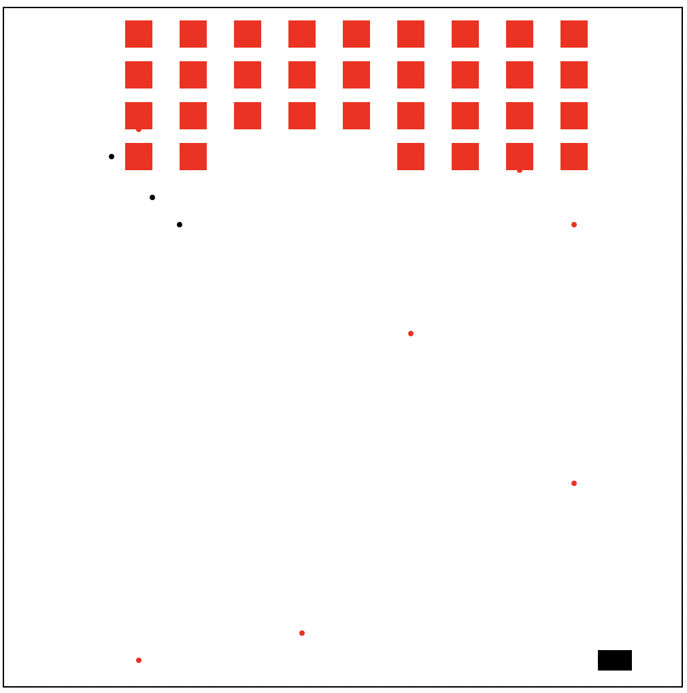

# Space Invaders Game (Racket)
<p align="center">
  
</p>

## Goal
To learn the basics of functional programming and unit testing using Racket

First coding project in my undergraduate career

## Overview
This is a simplified Space Invaders game implemented in Racket.
The game demonstrates functional programming, data-driven design, and event-based animation using big-bang.

Players control a spaceship that moves left and right, firing bullets to destroy rows of descending invaders.
The game ends when all invaders are destroyed or the ship is hit.

## Features
- Player-controlled spaceship with left/right movement and shooting
- Invader grid formation and projectile firing
- Collision detection between bullets and invaders
- Bullet cleanup for out-of-bounds objects
- Continuous animation via on-tick updates
- Unit tests using check-expect for all major functions

### Game Loop
```racket
(define (game w)
  (big-bang w
    [to-draw world-draw]
    [on-tick update-world 0.1]
    [on-key turn-and-shoot]
    [stop-when end? endscreen]))
```

### Core Functions
| Function | Purpose |
|----------|-------------|
| update-world | Updates ship, bullets, and removes collisions |
| move-world | Moves all movable entities |
| remove-hits-and-out-of-bounds | Cleans up bullets and destroyed invaders |
| invaders-fire | Allows invaders to shoot back |
| world-draw | Renders the current game state |

## Setup and Execution
Requirements:
- Racket 8.x or later
- 2htdp/universe and 2htdp/image libraries (bundled with Racket)

Run Instructions
1.	Open the file in DrRacket
2.	Click run